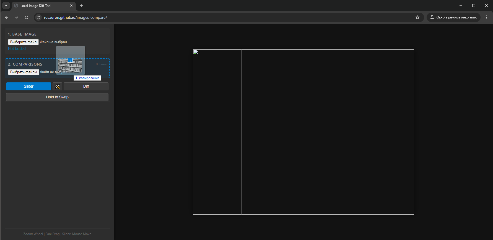

# images-compare
A simple offline browser tool for comparing a single source image with multiple variations. It helps to visualize exactly what a filter, AI model, or other software is doing.

Demo: 
https://rusauron.github.io/images-compare/

This code was written almost entirely by Gemini 3.
The code successfully performs the task I designed it for.
There are a few minor bugs remaining. I will resolve the scaling issue (it went unnoticed before publishing as all images fit on my screen), but other fixes will be addressed next week at the earliest.

Libraries used: 
* jQuery v3.6.0 | (c) OpenJS Foundation and other contributors | jquery.org/license
* James Cryer / Huddle | URL: https://github.com/Huddle/Resemble.js
* Panzoom for panning and zooming elements using CSS transforms | Copyright Timmy Willison and other contributors | https://github.com/timmywil/panzoom/blob/main/MIT-License.txt
